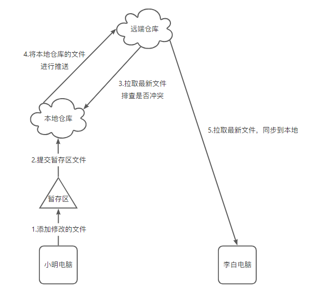

# <AppCode code="22" /> Git 工作流程

<ClientOnly><AppRead code="g10004" /></ClientOnly>

我们既然知道了要利用 git 工具进行将本地代码提交到线上仓库，以及通过线上仓库同步代码到本地，表面上大家可能认为只有两个步骤，不就是上传和同步嘛？其实里面还细化了一些其他事项。下面将会详细介绍一下 Git 完整的工作流程。

:::tip 指导
一样的教学方式，先不讲解代码，先讲思路。
:::

## 基础案例

1. 首先需要克隆项目，将线上仓库的项目拷贝一份副本到我们的电脑上（假设小明和李白都已经克隆好了）。

2. 刚开始创建的项目是空的，这个要注意了。

3. 小明在副本项目里面创建了 a.html 和 b.html。但是他只想更新 a.html 文件到线上仓库中，而 b.html 文件不想更新。所以就有了一个步骤，叫做添加文件到暂存区。暂存区就是存放准备要进行提交的文件。

4. 小明想了一会后，想清楚了，确定要把 a.html 提交上去。但此时文件还在暂存区，所以下一步的操作就是把暂存区的文件提交到本地仓库中，可能有同学问为什么不直接把文件更新到线上仓库上。还要多此一举呢？那万一李白刚好在你提交之前，他也提交了一个 a.html 到线上仓库，那是不是就冲突了，出问题了？所以必须要有一个步骤，就是提交代码之前必须先拉取线上仓库的代码，对比确认没问题后，才进行最后一步，推送，真正的把代码或者文件更新到线上仓库。那万一代码有冲突呢，两个人同时改了一个文件的同一行代码，假设有冲突，则需要合并冲突，然后在把冲突的文件重新提交到本地仓库，在进行一次代码拉取，最后在推送。

5. 小明推送代码上去后，李白就可以通过拉取的命令将 a.html 同步到本地了。

6. 整个流程就结束了。

## Git 代码提交工作流程

1. 添加文件到暂存区

2. 添加暂存区文件到本地仓库

3. 获取远端仓库对比本地仓库是否有冲突

4. 如果没有冲突，则将本地仓库的文件推送到远端仓库上

5. 如果有冲突，则处理完冲突后，重复步骤 2、3、4 即可

<AppComment />