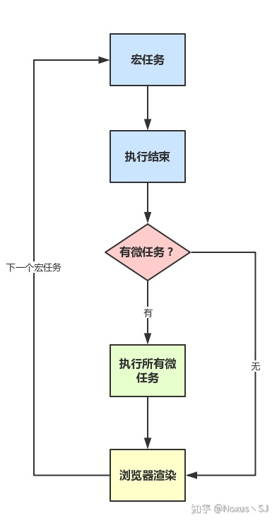

# <AppCode code="37" /> JavaScript 事件循环机制

<ClientOnly><AppRead code="j20005" /></ClientOnly>

## 事件循环机制

在事件循环中，每进行一次循环操作称为 tick，每一次 tick 的任务处理是比较复杂的。

关键步骤如下：

1. 执行一个宏任务

2. 执行过程中如果遇到微任务，就将它添加到微任务的任务队列中

3. 宏任务执行完毕后，立即执行当前微任务队列中的所有微任务（依次执行）

4. 当前宏任务执行完毕，开始检查渲染，然后 GUI 线程接管渲染

5. 渲染完毕后，JS 线程继续接管（开始下一个宏任务）

流程图如下：

那什么是宏任务、微任务呢？

## 宏任务

宏任务（macro task）可以理解为调用栈中的任务就是宏任务。

浏览器为了能够使得 JavaScrpit 内部 macro task 与 DOM 任务能够有序的执行，会在一个 macro task 执行结束后，在下一个 macro task 执行开始前，对页面进行重新渲染。

macro task 主要包含：script 整体代码、setTimeout、setInterval。

## 微任务

微任务（micro task）主要是存放一些异步任务，可以理解是在当前 macro task 执行结束后立即执行的任务。所以它的响应速度相比 setTimeout 会更快。

micro task 主要包含：Promise.then、await 方法后面的代码属于 .then（ await 相当于一个 Promise ）。

<AppComment />