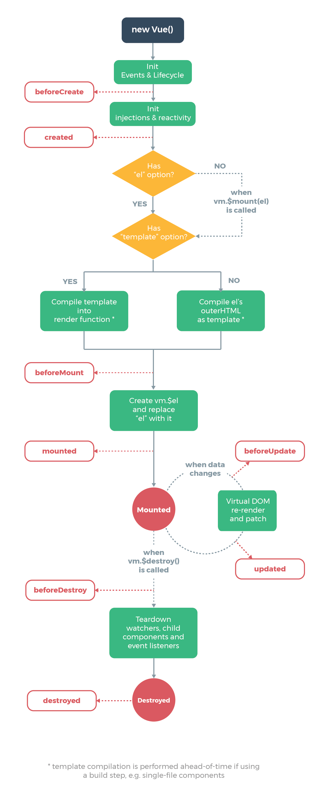

# <AppCode code="110" /> 生命周期钩子

<ClientOnly><AppRead code="v10011" /></ClientOnly>

:::warning 注意
所有生命周期钩子的 this 上下文将自动绑定至实例中，因此你可以利用 this 访问 props、data、computed 和 methods 等选项内的数据/函数。这意味着你不应该使用箭头函数来定义一个生命周期方法，因为箭头函数中没有 this，这样会导致 this 无法指向实例中。
:::

可以理解每一个组件就是一个实例，每个实例在被创建时都要经过一系列的初始化过程——例如，需要设置数据监听、编译模板、将实例挂载到 DOM 并在数据变化时更新 DOM 等。同时在这个过程中也会运行一些叫做生命周期钩子的函数，这给了用户在不同阶段添加自己的代码的机会。

也就是说，当你调用 new Vue 的时候直到页面被完全渲染，这两者的过程之间 Vue 是做了很多你看不见的事情，但是在几个比较重要的阶段中加入了生命周期钩子函数。代表支持了你可以在每个阶段中去执行特定的代码。比较常用的有 8 个生命周期钩子函数。

## 生命周期钩子函数

**beforeCreate**

在实例创建之前执行。

**created**

在实例创建之后执行。到了这一步意味着数据侦听、计算属性、方法、侦听器的回调函数已被配置完毕。

**beforeMount**

在实例挂载之前执行。到了这一步意味着已经对 el、template 进行了处理，最后转成了 render 函数，在执行完当前钩子后会进行 render 函数的首次调用。render 函数里面包含了即将要被渲染的 dom 内容。

**mounted**

在实例挂载之后执行。到了这一步意味着实例已经挂载完成了，页面上可以呈现效果了。注意 mounted 不会保证所有的子组件也都被挂载完成，仅仅是当前组件而已。如果你希望等到整个视图都渲染完毕再执行某些操作，可以在 mounted 内部使用 vm.$nextTick。

**beforeUpdate**

在实例更新之前执行。数据发生改变后，DOM 被更新之前被调用。这里适合在现有 DOM 将要被更新之前访问它，比如移除手动添加的事件监听器。

**updated**

在实例更新之后执行。在数据更改导致的虚拟 DOM 重新渲染和更新完毕之后被调用。当这个钩子被调用时，组件 DOM 已经更新，所以你现在可以执行依赖于 DOM 的操作。注意，updated 不会保证所有的子组件也都被重新渲染完毕。如果你希望等到整个视图都渲染完毕，可以在 updated 里使用 vm.$nextTick。

**beforeDestroy**

实例销毁之前执行。在这一步，实例仍然完全可用。

**destroyed**

实例销毁之后执行。该钩子被调用后，对应 Vue 实例的所有指令都被解绑，所有的事件监听器被移除，所有的子实例也都被销毁。

## 生命周期图示

<AppComment />