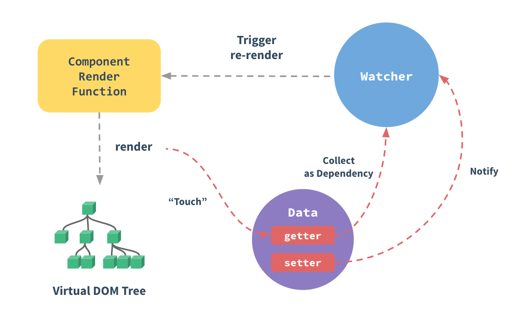

<script lang="ts" setup>
import { loginRead } from '@/utils/login-read'

loginRead('v10010')
</script>

# <AppCode code="109" /> 响应式

<ClientOnly><AppRead code="v10010" /></ClientOnly>

:::tip 提示
我们了解过响应式可以同步更新数据和视图，但是其工作原理我们最好也要了解一下。这样当你使用时遇到一些常见的错误，也能够快速定位是什么问题导致的。<br />
了解响应式原理之前，你必须要先去了解 ES5 的 `Object.defineProperty`。<br />
:::

响应式是 Vue 最独特的特性之一，之前我们在 MVVM 模式中也有介绍到数据模型。数据模型你可以理解就是在选项 data 中定义的变量。数据模型在响应式系统中仅仅是普通的 JavaScript 对象。而当你修改它们时，视图会进行更新。这使得状态管理非常简单直接。而在传统的模式中，你修改 JavaScript 定义的数据后，还要手动更新 dom 是比较繁琐的。

所以在响应式中我们要知道定义的数据它是如何被跟踪的。例如我修改了选项 data 中的数据， vue 是怎么知道我改了，然后去触发更新视图操作的。

## 如何追踪变化

当你把一个普通的 JavaScript 对象传入 Vue 实例作为 data 选项时，Vue 将遍历此对象所有的 property，并使用 `Object.defineProperty` 把这些 property 全部转为 getter/`setter。Object.defineProperty` 是 ES5 中一个无法 shim 的特性，这也就是 Vue 不支持 IE8 以及更低版本浏览器的原因。无法 shim 代表没有办法将其降级成其他 API 进行使用。

这些 getter/setter 对用户来说是不可见的，但是在内部它们让 Vue 能够追踪依赖，在 property 被访问和修改时通知变更。

每个组件实例都对应一个 watcher 实例，它会在组件渲染的过程中把“接触”过的数据 property 记录为依赖。之后当依赖项的 setter 触发时，会通知 watcher，从而使它关联的组件重新渲染。



通过代码的方式进行演示一遍

```vue
<template>
    <div id="app">
        {{ message }}
    </div>
</template>

<script>
export default {
    data() {
        return {
            message: 'Hello Vue!'
        }
    }
}
</script>
```

这是一个组件，所以会存在一个 watcher 实例，准备渲染这个页面之前，Vue 会把选项 data 的所有属性进行遍历并设置 getter/setter。在 getter 方法中实现了如果访问此属性，则会把访问的相关信息存储到依赖中记录。在 setter 方法中实现了如果此属性的数据被改了，则会通知 watcher 把当前属性所有依赖项关联的地方都重新渲染。例如 `{ message }` 访问了 `message` 属性，所以它会被记录到依赖项中，当 `message` 属性被修改时，则 `{ message }` 的部分会被重新渲染。

## 避免遇到 bug 无法跟踪问题

由于 JavaScript 的限制，Vue 不能检测数组和对象的变化。

因为 Vue2.0 的源码中是使用了 `Object.defineProperty` 进行实现响应式，Vue 会先遍历一个数组或对象，对其的每一个属性设置监听变化，所以你后面添加进来的属性，是不会触发监听变化的，也就是说你改了这个值，页面上绑定了这个值的元素也不会更新。

但是这个问题在 Vue3.0 中已经解决了，源码中使用了 Proxy 代理，这个 API 是可以直接监听一整个数组或对象的变化。而 `Object.defineProperty` 只能监听数组或对象上面的属性变化。

目前在单文件组件形式测试过了，就算不是响应式也能够同步页面更新，不确定是否在 Vue2.0 新版本中解决了，欢迎复现的小伙伴一起讨论。

<AppComment />