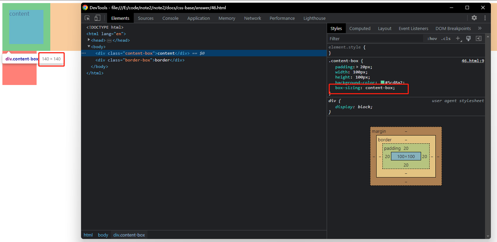
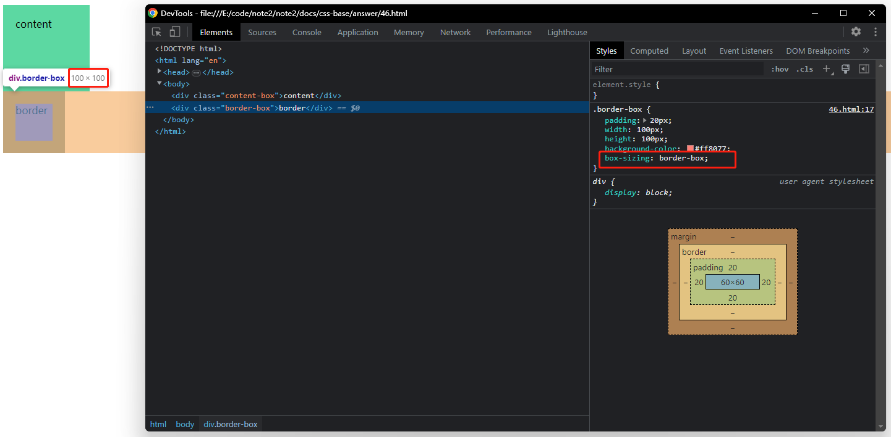

## 回答

盒子模型主要分为 W3C 盒模型和 IE 盒模型，分别对应为 content-box 和 border-box。一假设一个盒子的宽度和高度是 100px，那么它在网页中实际占用的空间就是 100px \_ 100px 。但是你给它设置了 padding: 20px 之后，两种盒模型的区别就呈现了，在 content-box 中，盒子在网页占据的空间就是 140px \* 140px 。而 border-box 依然是 100px \* 100px。因为 content-box 会把 padding、border 计算到占据的空间内。

## 验证

以下是截图验证。

content-box 截图效果

 

border-box 截图效果

