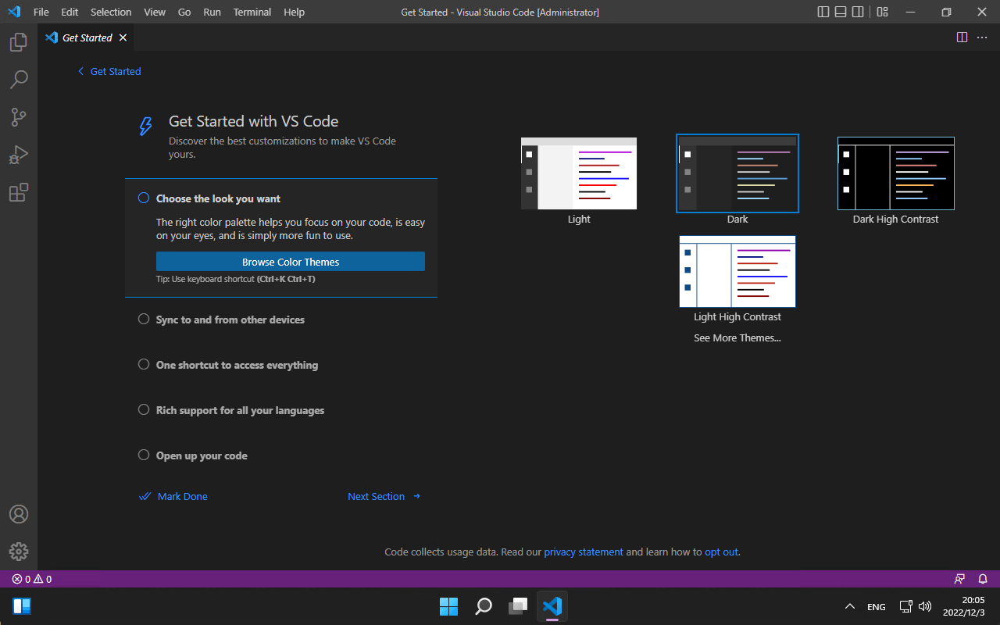
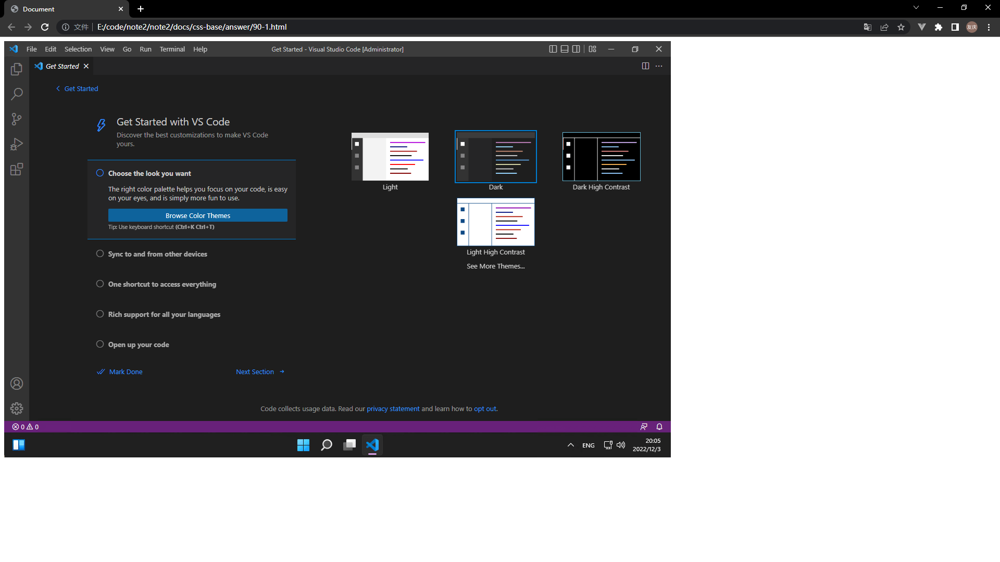
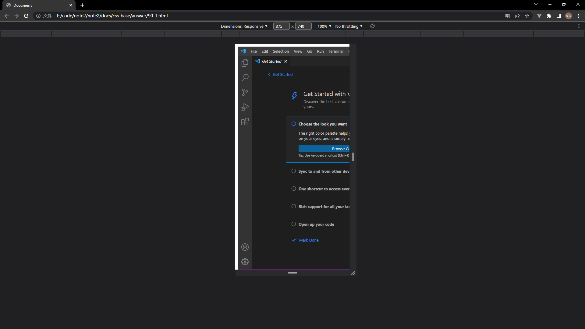

## 回答

静态布局在我们开发中会相对比较简单，无需考虑其他兼容问题。但是也会存在一些问题，例如我在 PC 端设置了一个宽度为 1280px 的图片，可以完整的展示。但是切换到移动端时候，图片宽度依然是 1280px 导致在手机上看不全图片，只能看到一小部分，并且还会出现横向滚动条。

## 验证

以下是静态布局的代码。

```html
<!DOCTYPE html>
<html lang="en">
    <head>
        <meta charset="UTF-8" />
        <meta http-equiv="X-UA-Compatible" content="IE=edge" />
        <meta name="viewport" content="width=device-width, initial-scale=1.0" />
        <title>Document</title>
    </head>
    <body>
        
    </body>
</html>
```

<br />

以下是能够正常展示的截图



<br />

以下是不能够正常展示的截图


