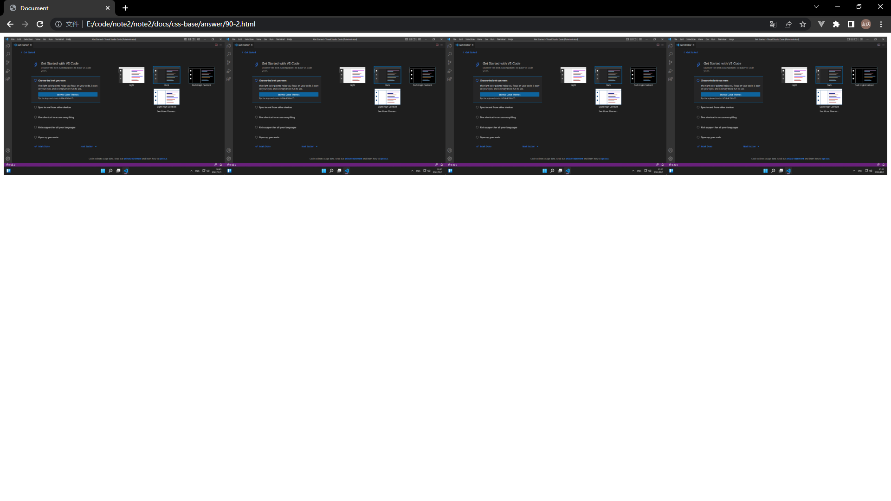
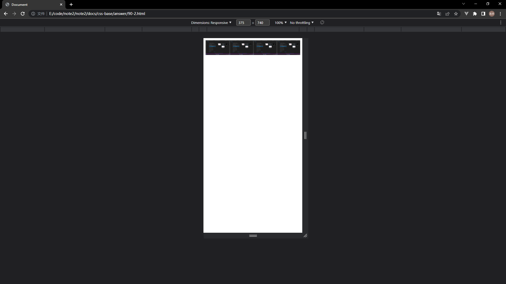

## 回答

自适应布局相比静态布局要灵活很多，但是也会存在一些问题。例如在 PC 端网页中，一行展示了 4 张图片，是可以正常观看的。虽然做了自适应，但是在移动端依然是一行展示 4 张图片，显然是看不清的，图片会挤在一起。

## 验证

以下是自适应布局的代码。

```html
<!DOCTYPE html>
<html lang="en">
    <head>
        <meta charset="UTF-8" />
        <meta http-equiv="X-UA-Compatible" content="IE=edge" />
        <meta name="viewport" content="width=device-width, initial-scale=1.0" />
        <title>Document</title>

        <style>
            .box {
                display: flex;
            }

            .box img {
                width: 25%;
            }
        </style>
    </head>
    <body>
        <div class="box">
            
            
            
            
        </div>
    </body>
</html>
```

<br />

以下是能够正常展示的截图



<br />

以下是不能够正常展示的截图


