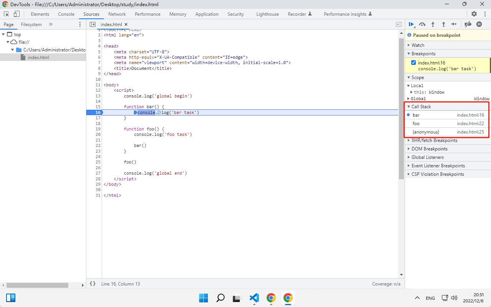

## 回答

```javascript
console.log('global begin')

function bar() {
    console.log('bar task')
}

function foo() {
    console.log('foo task')

    bar()
}

foo()

console.log('global end')
```

## 验证



在图片中可以看到 Call Stack 单词，代表调用栈。调用栈存在 bar、foo、anonymous。其中 anonymous 就代表了我们整个 script 的代码。执行完 bar 函数后就会进行出栈，然后继续执行 foo 函数，以此类推直到把栈都出完。
